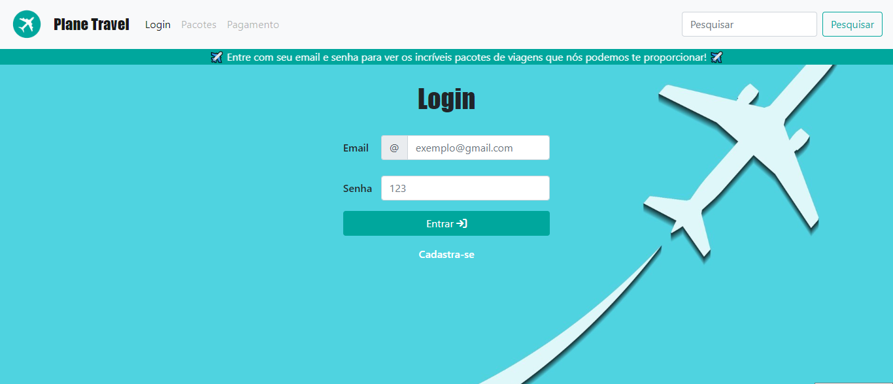

# Planet Travel - Simulador de Compra de Pacotes de Viagem

Bem-vindo ao repositório do Planet Travel! Este projeto tem como objetivo simular a experiência de compra de um pacote de viagem, oferecendo uma página de login vinculada a um banco de dados fictício e uma forma de pagamento para efetuar a compra. O site está em desenvolvimento e utiliza as seguintes tecnologias:

## Objetivo do Projeto

O Planet Travel visa proporcionar uma experiência intuitiva e segura para os usuários que desejam comprar pacotes de viagem. As principais funcionalidades incluem:

- **Página de Login:** Os usuários podem se autenticar em suas contas para acessar ofertas exclusivas e realizar compras.
- **Compra de Pacotes:** Os usuários podem explorar uma variedade de pacotes de viagem e selecionar aqueles que desejam adquirir.
- **Forma de Pagamento:** Após selecionar os pacotes desejados, os usuários podem escolher o método de pagamento e finalizar a compra de forma segura.
- **Banco de Dados Fictício:** O projeto inclui um banco de dados fictício para armazenar informações de login e detalhes da compra.

## Tecnologias Utilizadas

O projeto é desenvolvido utilizando as seguintes tecnologias:

   

## Imagem do Projeto

## Acesso ao Projeto

Você pode acessar o site do projeto [aqui](https://anayukimoto.github.io/planetravel.github.io/). 

